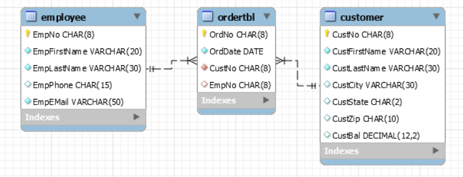

Structured Query Language (SQL) is used to manage data in all relational database management systems such as MySQL, Oracle, SQL Server, and more. SQL standards are maintained by [ISO](https://en.wikipedia.org/wiki/ISO/IEC_9075). While most database products comply with the ISO standard, they also offer additional proprietary features. In this blog post we're going to restrict ourselves to the feature set offered by [MySQL](https://www.mysql.com/) databases.

---

## MySQL data types and operators

Each column in a database table is required to have a name and a data type. When designing databases we have to decide what kind of data will be stored in its database tables. Data types allow SQL to understand and interact with the stored data within database table columns. MySQL supports SQL data types in multiple categories: numeric types, date and time types, string (character and byte) types, spatial types, and the JSON data type.

Also, it's noteworthy to mention the operators that we can use in SQL expressions. Operators can be broken into three main categories: arithmetic, comparison, and logical.

## Simple MySQL example

Imagine that you own a business. This business sells video games via its website and also via its physical store location. Customers can place orders with employees on-site or buy video games online without an employee's assistance. The order table links both employees and customers, however each order doesn't necessarily need an employee foreign key as mentioned before! A database and tables would help us manage all of this information:



How would we create and populate the database and tables pictured above? It's quite straightforward, don't worry. Also, I'll dive into how to read data and use update/delete statements to alter data.

## Creating a database and tables

In order to start working with databases we need to create one. With the `CREATE DATABASE` statement we can do just that. Interacting with the database is as simple as using the `USE DATABASE` statement followed by any other statements you'd like.

The `CREATE TABLE` statement allows us to create a table with a given name. There are [many aspects](https://dev.mysql.com/doc/refman/8.0/en/create-table.html) to the `CREATE TABLE` statement described under the following topics: table name, temporary tables, table cloning and copying, column data types and attributes, indexes/foreign keys/check constraints, table options, and table partitioning. Let's put this into practice and create a database with tables:

```sql
CREATE DATABASE MaxOverflowExample;
USE MaxOverflowExample;

CREATE TABLE Customer (
	CustNo 	CHAR(8),
	CustFirstName	VARCHAR(20) NOT NULL,
	CustLastName	VARCHAR(30) NOT NULL,
	CustCity		VARCHAR(30),
	CustState	CHAR(2),
	CustZip	CHAR(10),
	CustBal		DECIMAL(12,2),
	CONSTRAINT PKCustomer PRIMARY KEY (CustNo)
 );

 CREATE TABLE Employee(
	EmpNo 	 CHAR(8),
	EmpFirstName VARCHAR(20) NOT NULL,
	EmpLastName VARCHAR(30) NOT NULL,
	EmpPhone		 CHAR(15),
	EmpEMail		 VARCHAR(50) NOT NULL,
	CONSTRAINT PKEmployee PRIMARY KEY (EmpNo),
	CONSTRAINT UniqueEMail UNIQUE (EmpEMail)
);

CREATE TABLE OrderTbl (
    OrdNo 	CHAR(8),
    OrdDate	DATE NOT NULL,
    CustNo		CHAR(8) NOT NULL,
    EmpNo	CHAR(8),
	CONSTRAINT PKOrderTbl PRIMARY KEY (OrdNo) ,
	CONSTRAINT FKCustNo FOREIGN KEY (CustNo) REFERENCES Customer (CustNo),
	CONSTRAINT FKEmpNo FOREIGN KEY (EmpNo) REFERENCES Employee (EmpNo)
);
```

As you can see, each table has a unique primary key column to identify each table row. In the order table, there are two foreign key columns to link back to employees that sold customers video games at our physical store. Moreover, the order table tracks all orders for us including online orders.

## Inserting data

Let's insert some data into these bad boys. This is done via the `INSERT INTO` statement. When we use an `INSERT` statement, we have to match up our data to conform to the data types and constraints we defined in our `CREATE TABLE` statement.

Note the order I insert the data as well. I insert data into the employee and customer tables first since the order table contains rows that reference back to those entries.

```sql
USE MaxOverflowExample;

INSERT INTO Customer
    (CustNo, CustFirstName, CustLastName, CustCity, CustState, CustZip, CustBal)
    VALUES('C0954327','Sheri','Gordon','Littleton','CO','80129-5543',230.00);

INSERT INTO Employee
    (EmpNo, EmpFirstName, EmpLastName, EmpPhone, EmpEMail)
    VALUES ('E8544399','Joe','Jenkins','(303) 221-9875','JJenkins@bigco.com');

INSERT INTO OrderTbl
    (OrdNo, OrdDate, CustNo, EmpNo)
    VALUES ('O9919699','2017-02-11','C0954327','E8544399');
```

## Reading data

We can query our database tables using the `SELECT` statement. `SELECT` queries can become quite complex when dealing with a production level database. Here, I demonstrate how you can get all the data from all three tables we created.

```sql
USE MaxOverflowExample;

SELECT * FROM Customer;
SELECT * FROM Employee;
SELECT * FROM Ordertbl;
```

## Updating and deleting data

For updating and deleting data in our database tables we can use the `UPDATE` and `DELETE` statements. All that's needed is to specify the primary key of the row we'd like to either update or delete.

Sidenote: the variable "SQL_SAFE_UPDATES" is enabled by default. This prevents the MySQL database engine from executing `UPDATE` and `DELETE` statements that don't include WHERE clauses that reference the primary key column(s). This saves you from affecting every row in the given table.

```sql
USE MaxOverflowExample;

-- Update customer first name
UPDATE Customer
  SET CustFirstName = 'George'
  WHERE CustNo = 'C0954327';

-- Delete rows added
DELETE FROM OrderTbl
  WHERE OrdNo = 'O9919699';

DELETE FROM Employee
  WHERE EmpNo = 'E8544399';

DELETE FROM Customer
  WHERE CustNo = 'C0954327';
```

---

I hope this post helped boost your MySQL [power level](https://dragonball.fandom.com/wiki/Power_Level). If you like video format better, I have a [YouTube playlist](https://www.youtube.com/playlist?list=PLg7mHz5jVDueWom70v1JjpaCfxwh99_fC) where I demonstrate everything in the MySQL workbench. MySQL is a database management system that allows us to interact with and design databases. With a solid foundation of MySQL basics, you can start designing and interacting with databases.

## Works Cited

- “MySQL 8.0 Reference Manual.” _MySQL_, [https://dev.mysql.com/doc/refman/8.0/en/](https://dev.mysql.com/doc/refman/8.0/en/).
